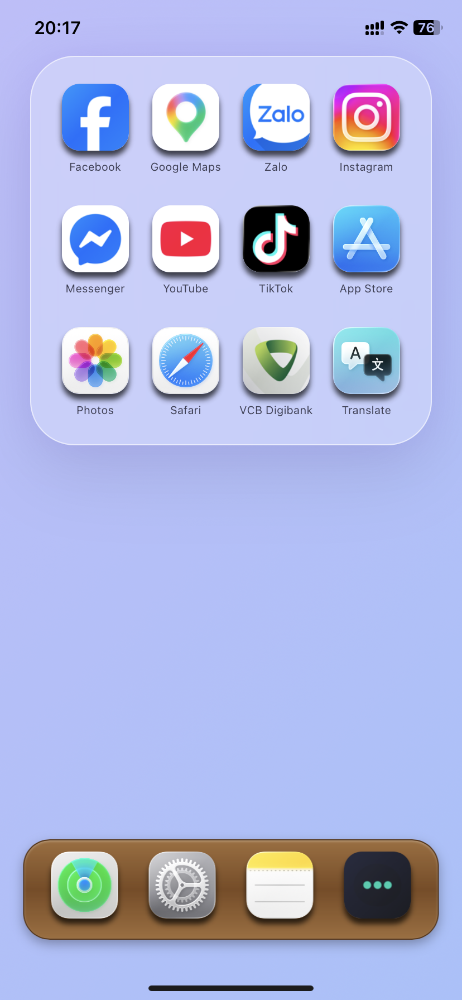

# 🏂 Open-Applist
### Kho lưu trữ Webclip & Phím tắt (Shortcuts) tối ưu cho hệ sinh thái Apple

**Tác giả: Sentechtipsvn 🇻🇳**
 
*Webclip giả lập màn hình chính trên iPhone, kết hợp với ứng dụng Phím tắt để mở các ứng dụng thường dùng, mang lại trải nghiệm cá nhân hóa tối đa.*

---
## 📸 Demo - [⬇️](https://ngocsen.github.io/Open-Applist/)

  

---

## ✨ Tính năng nổi bật

- 🍎 **Tối ưu cho iOS/iPadOS:** Giao diện kính mờ (Glassmorphism) đúng chuẩn VisionOS.
- ⚡ **Gọi Shortcuts siêu nhanh:** Chỉ cần 1 chạm để mở ứng dụng qua URL Scheme.
- 🎨 **Hiệu ứng đỉnh cao:** Tùy chỉnh bóng đổ (Shadow), viền (Stroke), kiểu bo góc (Radius) theo ý thích.
- 📂 **Quản lý linh hoạt:** Thêm, xóa, đổi tên, sắp xếp icon, Dock tùy biến (Kính, Gỗ iOS 6, Mờ đen).
- 📴 **Hoạt động ngoại tuyến (Offline):** Tích hợp Service Worker giúp mở nhanh khi mất mạng.
- 🌙 **Hỗ trợ Dark Mode:** Tự động chuyển giao diện tối khi hệ thống bật Dark Mode.

---

## 🚀 Hướng dẫn sử dụng

### 1. Cài đặt lên iPhone / iPad:
1. Mở trang GitHub Pages (Webclip) bằng trình duyệt **Safari**.
2. Bấm nút **Share** (Chia sẻ) -> chọn **Add to Home Screen** (Thêm vào màn hình chính).
3. Đặt tên cho ngắn gọn (ví dụ: AppList) và bấm **Add**.

### 2. Tạo Shortcuts trên iOS (Bắt buộc):
1. Mở app **Shortcuts** (Phím tắt) trên iPhone.
2. Tạo Shortcut mới với tên **`Open App Launcher`** (Đúng tên này để web gọi được).
3. Thêm hành động **Receive Input from URL** (Nhận đầu vào từ URL).
4. Chạy lệnh mở ứng dụng dựa trên Input nhận được (Tên hoặc Bundle ID).

---

## 🛠️ Công nghệ sử dụng

- **Ngôn ngữ:** HTML5, CSS3, JavaScript (ES6+).
- **Nền tảng:** Web Clip (PWA) trên iOS.
- **Công cụ:** Visual Studio Code, GitHub Pages.

---

## 📄 Giấy phép

Dự án được phát hành dưới giấy phép **[MIT License](https://raw.githubusercontent.com/Ngocsen/Open-Applist/refs/heads/Snowboard/LICENSE)**. Bạn có thể sử dụng, chỉnh sửa và phát triển thêm cho mục đích cá nhân.

---

## 💖 Donate & Ủng hộ

Nếu thấy dự án hữu ích, hãy bấm **Star** ⭐ cho repo và theo dõi kênh của mình nhé!

